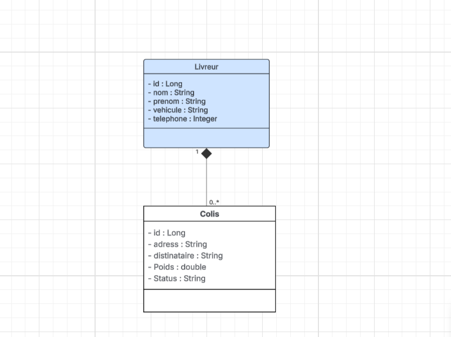

# 🚚 Smart-Delivery

> A lightweight Spring-based delivery management API for managing delivery persons and packages with full CRUD operations.

[](https://www.oracle.com/java/)
[](https://spring.io/projects/spring-boot)
[](LICENSE)

---

## 📑 Table of Contents

- [Overview](#-overview)
- [Features](#-features)
- [Architecture](#-architecture)
- [Getting Started](#-getting-started)
    - [Prerequisites](#prerequisites)
    - [Installation](#installation)
    - [Configuration](#configuration)
- [Data Model](#-data-model)
- [API Reference](#-api-reference)
    - [Livreur Endpoints](#livreur-endpoints)
    - [Colis Endpoints](#colis-endpoints)
- [Usage Examples](#-usage-examples)
- [Testing](#-testing)
- [Troubleshooting](#-troubleshooting)
- [Roadmap](#-roadmap)
- [Contributing](#-contributing)
- [License](#-license)

---

## 🎯 Overview

**Smart-Delivery** is a RESTful API built with Spring Boot that simplifies delivery management operations. It provides a robust backend for tracking delivery personnel (Livreurs) and their assigned packages (Colis), making it ideal for logistics companies, delivery services, or e-commerce platforms.

### Key Technologies

- **Framework**: Spring Boot with Spring Data JPA
- **Persistence**: JPA/Hibernate with Jakarta Persistence API
- **Serialization**: Jackson (with JSON reference handling)
- **Database**: Configurable (supports MySQL, PostgreSQL, H2)
- **Build Tool**: Maven

---

## ✨ Features

- ✅ Complete CRUD operations for delivery persons and packages
- ✅ Bi-directional relationship management between Livreurs and Colis
- ✅ JSON cycle prevention with `Jackson`
- ✅ Cascade operations and orphan removal for data integrity
- ✅ RESTful API design with JSON request/response
- ✅ Eager fetching for optimized data retrieval
- ✅ Extensible architecture for custom business logic

---

## 🏗️ Architecture

### Project Structure

```
src/main/java/com/smartlogi/
├── model/
│   ├── Livreur.java          # Delivery person entity
│   └── Colis.java            # Package entity
├── repository/
│   ├── LivreurRepository.java
│   └── ColisRepository.java
├── service/
│   ├── LivreurService.java   # Business logic for livreurs
│   └── ColisService.java     # Business logic for colis
└── controller/
    ├── LivreurController.java
    └── ColisController.java
```

### Technology Stack

```
┌─────────────────────────────────────┐
│        Controllers Layer            │
│   (HTTP Request Handling)           │
├─────────────────────────────────────┤
│         Service Layer               │
│     (Business Logic)                │
├─────────────────────────────────────┤
│       Repository Layer              │
│       (Spring Data JPA)             │
├─────────────────────────────────────┤
│         Database Layer              │
│           PostgreSQL                │
└─────────────────────────────────────┘
```

---

## 🚀 Getting Started

### Prerequisites

Ensure you have the following installed:

- **Java Development Kit (JDK)**: Version 17 or higher
- **Maven**: Version 3.6+ for dependency management
- **Database**: PostgreSQL
- **IDE** (Optional): IntelliJ IDEA, Eclipse, or VS Code

### Installation

1. **Clone the repository**
   ```bash
   git clone https://github.com/yourusername/smart-delivery.git
   cd smart-delivery
   ```

2. **Install dependencies**
   ```bash
   mvn clean install
   ```

3. **Run the application**
   ```bash
   mvn spring-boot:run
   ```

   Or run directly from your IDE by executing the main Spring Boot application class.

4. **Verify the application is running**
   ```bash
   curl http://localhost:8080/livreurs
   ```


---

## 📊 Data Model

### Entity Relationship Diagram

```
┌─────────────────────┐         ┌──────────────────────┐
│      Livreur        │         │        Colis         │
├─────────────────────┤         ├──────────────────────┤
│ id (PK)             │ 1     N │ id (PK)              │
│ nom                 │◄────────┤ destinataire         │
│ prenom              │         │ adresse              │
│ vehicule            │         │ poids                │
│ telephone           │         │ statut               │
│ colisList           │         │ livreur_id (FK)      │
└─────────────────────┘         └──────────────────────┘
```

```

### Livreur (Delivery Person)

| Field       | Type          | Description                    |
|-------------|---------------|--------------------------------|
| `id`        | Long          | Primary key (auto-generated)   |
| `nom`       | String        | Last name                      |
| `prenom`    | String        | First name                     |
| `vehicule`  | String        | Vehicle type (e.g., Scooter)   |
| `telephone` | String        | Contact phone number           |
| `colisList` | List\<Colis\> | Associated packages (EAGER)    |

**Annotations**: `@JsonManagedReference`, Cascade ALL, orphanRemoval = true

### Colis (Package)

| Field          | Type    | Description                          |
|----------------|---------|--------------------------------------|
| `id`           | Long    | Primary key (auto-generated)         |
| `destinataire` | String  | Recipient name                       |
| `adresse`      | String  | Delivery address                     |
| `poids`        | double  | Package weight (kg)                  |
| `statut`       | String  | Status (EN_ATTENTE, EN_ROUTE, etc.)  |
| `livreur`      | Livreur | Associated delivery person           |

**Annotations**: `@JsonBackReference` (prevents JSON cycles)

---

## 📡 API Reference

Base URL: `http://localhost:8080`

### Livreur Endpoints

#### Get All Livreurs
```http
GET /livreurs
```

---

## Class Diagram


---

**Response**: `200 OK`
```json
[
  {
    "id": 1,
    "nom": "Doe",
    "prenom": "John",
    "vehicule": "Scooter",
    "telephone": "0612345678",
    "colisList": [...]
  }
]
```

#### Get Livreur by ID
```http
GET /livreurs/{id}
```

**Response**: `200 OK` or `404 Not Found`

#### Create Livreur
```http
POST /livreurs
Content-Type: application/json
```

**Request Body**:
```json
{
  "nom": "Doe",
  "prenom": "John",
  "vehicule": "Scooter",
  "telephone": "0612345678"
}
```

**Response**: `201 Created`

#### Update Livreur
```http
PUT /livreurs/{id}
Content-Type: application/json
```

**Request Body** (partial update supported):
```json
{
  "vehicule": "Van",
  "telephone": "0687654321"
}
```

**Response**: `200 OK`

#### Delete Livreur
```http
DELETE /livreurs/{id}
```

**Response**: `204 No Content`

⚠️ **Note**: Deleting a Livreur will cascade delete all associated Colis due to orphanRemoval.

---

### Colis Endpoints

#### Get All Colis
```http
GET /colis
```

#### Get Colis by ID
```http
GET /colis/{id}
```

#### Create Colis
```http
POST /colis
Content-Type: application/json
```

**Request Body**:
```json
{
  "destinataire": "Alice Dubois",
  "adresse": "123 Rue de la Paix, Paris",
  "poids": 2.5,
  "statut": "EN_ATTENTE",
  "livreur": {
    "id": 1
  }
}
```

**Status Values**: `EN_ATTENTE`, `EN_ROUTE`, `LIVRE`, `ANNULE`

#### Update Colis
```http
PUT /colis/{id}
Content-Type: application/json
```

#### Delete Colis
```http
DELETE /colis/{id}
```

---

## 💡 Usage Examples

### Using cURL

**Create a new delivery person**:
```bash
curl -X POST http://localhost:8080/livreurs \
  -H "Content-Type: application/json" \
  -d '{
    "nom": "Martin",
    "prenom": "Sophie",
    "vehicule": "Bicycle",
    "telephone": "0698765432"
  }'
```

**Get all delivery persons**:
```bash
curl http://localhost:8080/livreurs
```

**Update a delivery person's vehicle**:
```bash
curl -X PUT http://localhost:8080/livreurs/1 \
  -H "Content-Type: application/json" \
  -d '{"vehicule": "Electric Van"}'
```

**Create a package assigned to a delivery person**:
```bash
curl -X POST http://localhost:8080/colis \
  -H "Content-Type: application/json" \
  -d '{
    "destinataire": "Jean Dupont",
    "adresse": "45 Avenue des Champs-Élysées, Paris",
    "poids": 1.8,
    "statut": "EN_ROUTE",
    "livreur": {"id": 1}
  }'
```

**Update package status**:
```bash
curl -X PUT http://localhost:8080/colis/1 \
  -H "Content-Type: application/json" \
  -d '{"statut": "LIVRE"}'
```

**Delete a package**:
```bash
curl -X DELETE http://localhost:8080/colis/1
```

### Using Postman

1. Import the API endpoints into Postman
2. Set `Content-Type: application/json` in Headers
3. Use the JSON examples above in the Body (raw)
4. Send requests and observe responses

---

---

## 🔧 Troubleshooting

### Common Issues

**Problem**: "Request body is empty" error
- **Solution**: Ensure you're setting `Content-Type: application/json` header and sending valid JSON in the request body.

**Problem**: JSON parsing errors when creating Colis
- **Solution**: Verify that the `livreur` object includes a valid `id` field that references an existing Livreur.

**Problem**: Database connection errors
- **Solution**: Check your `application.properties` database configuration. Ensure the database server is running and credentials are correct.

**Problem**: Circular reference exceptions
- **Solution**: The entities use `@JsonManagedReference` and `@JsonBackReference`. Ensure these annotations are properly configured on both sides of the relationship.

**Problem**: NullPointerException when deleting
- **Solution**: The current implementation may not handle non-existent IDs gracefully. Add null checks in service layer before delete operations.

### Debug Tips

1. Enable SQL logging to see generated queries:
   ```properties
   spring.jpa.show-sql=true
   logging.level.org.hibernate.SQL=DEBUG
   ```

2. Check application logs for stack traces

3. Verify database schema matches entity definitions

---

## 🤝 Contributing

We welcome contributions! Here's how you can help:

1. **Fork the repository**
2. **Create a feature branch**
   ```bash
   git checkout -b feature/amazing-feature
   ```
3. **Commit your changes**
   ```bash
   git commit -m 'Add some amazing feature'
   ```
4. **Push to the branch**
   ```bash
   git push origin feature/amazing-feature
   ```
5. **Open a Pull Request**

### Development Guidelines

- Keep JPA entities in `model/` package
- Database access logic belongs in `repository/`
- Business logic should be in `service/` layer
- HTTP handling stays in `controller/` package
- Write unit tests for all new features
- Follow existing code style and conventions
- Update documentation for API changes

---

<div align="center">
  Made with ❤️ by Wissam
</div>